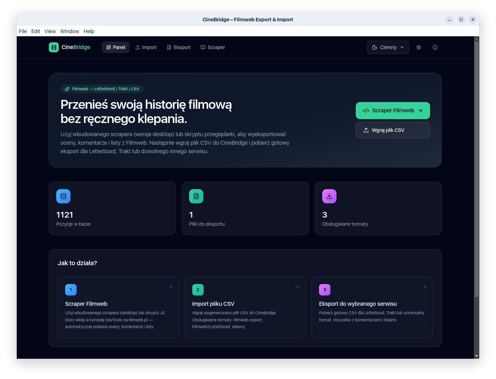
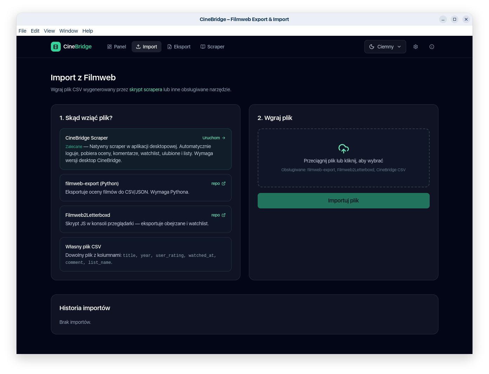
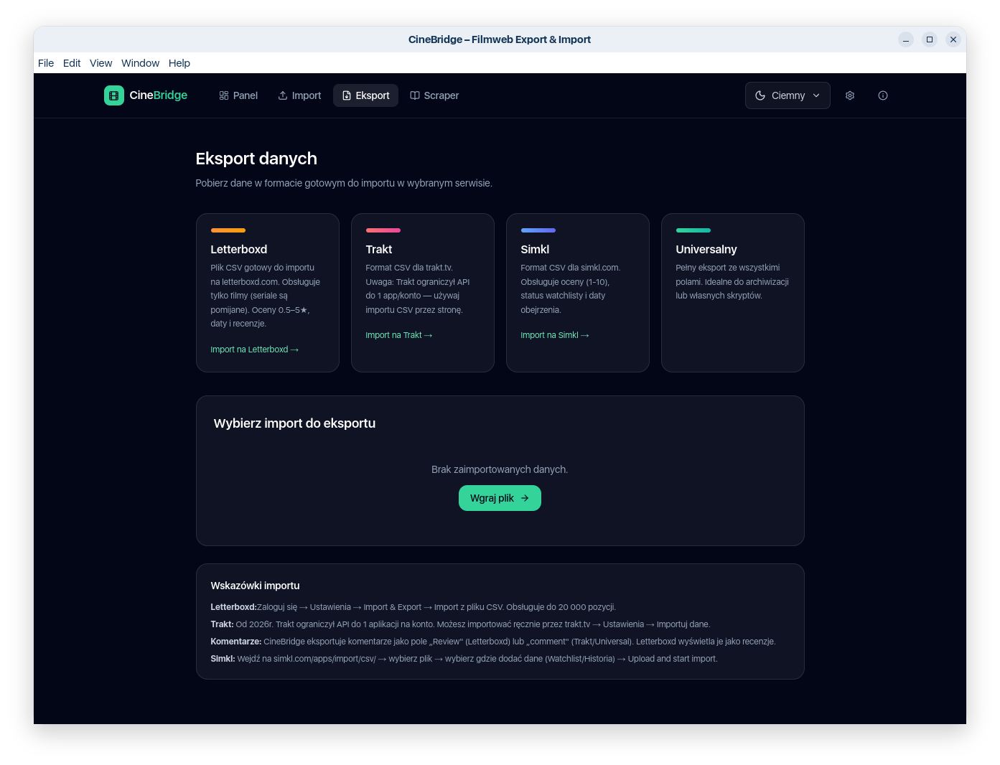

# 🎬 CineBridge

**Migruj swoją historię filmową z Filmweb.pl do Letterboxd, Trakt, Simkl i innych serwisów — w pełni automatycznie.**

[](https://github.com/marcin77/CineBridge/releases)
[](LICENSE)
[](https://github.com/marcin77/CineBridge/releases)

CineBridge to aplikacja desktopowa z wbudowanym scraperem Filmweb, który pobiera Twoje oceny, komentarze, watchlistę i listy, a następnie eksportuje je do formatów kompatybilnych z popularnymi serwisami filmowymi.

---

## ✨ Główne funkcje

### 🤖 Natywny scraper Filmweb (wersja desktop)
- **Zero konfiguracji** — otwórz aplikację, zaloguj się, kliknij "Synchronizuj"
- **Automatyczne logowanie** z obsługą CAPTCHA (natywne okno przeglądarki Electron)
- **Auto re-login** przy wygaśnięciu sesji (synchronizacja trwa bez przerwy nawet przy 30+ minutach pracy)
- **Checkpoint co 50 pozycji** — wznawia od miejsca przerwania po Stop/błędzie/restarcie
- **Circuit breaker** — automatycznie zmniejsza równoległość przy rate limitach (429)
- **Równoległe pobieranie** (2-3 requestów jednocześnie) z jitterem — 2-3x szybsze niż wersja sekwencyjna

#### Co scraper zbiera?
- ✅ **Oceny filmów** (data oceny, komentarz)
- ✅ **Oceny seriali** (data oceny, komentarz)
- ✅ **Watchlist** (Chcę zobaczyć)
- ✅ **Ulubione**
- ✅ **Listy użytkownika** (robocze i opublikowane)
- ✅ **Reżyserów** (do lepszego matchingu w Letterboxd)

### 📥 Elastyczny import
Oprócz wbudowanego scrapera, CineBridge obsługuje:
- [filmweb-export](https://github.com/ppatrzyk/filmweb-export) (Python CLI)
- [Filmweb2Letterboxd](https://github.com/JSerwatka/Filmweb2Letterboxd)
- Własny CSV (parser rozpoznaje aliasy kolumn automatycznie)

### 🔍 Matching TMDB
- Automatyczne dopasowanie tytułów do TMDB ID
- Wykrywanie duplikatów
- Ręczna korekta przez wyszukiwarkę

### 📤 Eksport do serwisów

#### 📽️ Letterboxd
- **ZIP z podziałem na pliki:**
  - `watched.csv` — historia oglądania z ocenami i recenzjami
  - `watchlist.csv` — filmy do obejrzenia
  - `lists/*.csv` — każda lista Filmweb osobno
- Kolumna `Directors` dla lepszego matchingu
- Automatyczna konwersja ocen 1-10 → 0.5-5.0

#### 🔥 Trakt.tv
- OAuth 2.0 Device Flow (bezpieczne logowanie bez hasła)
- Sync ocen, dat obejrzenia, komentarzy
- Obsługa watchlisty i list

#### 📺 Simkl
- Format CSV zgodny z oficjalnym [importerem Simkl](https://simkl.com/apps/import/csv/)

#### 📊 Universal CSV
- Pełny format zachowujący wszystkie pola (backup/archiwizacja)

### 🎨 Dodatki
- **Theme switcher** (jasny / ciemny / system)
- **Wersja web** (scraper konsolowy jako fallback dla non-Electron)
- **SQLite** — lokalna baza danych, zero konfiguracji

---

## 📸 Screenshot

| Strona startowa | Import | Export |
|--------------|---------------|-----------|
|  |  |  |

---

## 🛠️ Stack technologiczny

| Warstwa | Technologia |
|---------|-------------|
| **Desktop** | Electron 33+ |
| **Frontend** | Next.js 15 (App Router), React 19 |
| **Styling** | Tailwind CSS v4, next-themes |
| **Database** | SQLite (better-sqlite3), Drizzle ORM |
| **Language** | TypeScript |
| **Scraper** | Native Electron BrowserWindow + Filmweb API |
| **Build** | electron-builder (AppImage/DMG/EXE) |

---

## 📦 Instalacja i uruchomienie

### Dla użytkowników końcowych (binarka)

1. **Pobierz najnowszą wersję** z [Releases](https://github.com/your-username/cinebridge/releases)
2. **Linux:** `CineBridge-1.0.0-x86_64.AppImage`
```markdown
   chmod +x CineBridge-1.0.0-x86_64.AppImage
   ./CineBridge-1.0.0-x86_64.AppImage
```
3. **Windows:** `CineBridge-Setup-1.0.0.exe` (TODO)
4. **macOS:** `CineBridge-1.0.0.dmg` (TODO)


### Dla developerów

#### Wymagania
- Node.js 18+ (zalecane 20 LTS)
- npm lub yarn

#### Kroki

```bash
# 1. Sklonuj repo
git clone https://github.com/your-username/cinebridge.git
cd cinebridge

# 2. Zainstaluj zależności
npm install

# Next.js dev server + Electron jednocześnie
npm run electron:dev

# Lub tylko Next.js (bez Electrona — np. do pracy nad UI)
npm run dev

```
Aplikacja Electron otworzy się automatycznie na http://localhost:3000 (Next.js dev server w tle).

## 🚀 Build produkcyjny

```bash
# Pakuj dla Linux (AppImage)
npm run build:linux

# Pakuj dla Windows (exe)
npm run build:win

# Wynik:
# - Linux: dist/CineBridge-1.0.0-x86_64.AppImage
# - Windows: dist/CineBridge-Setup-1.0.0.exe
# - macOS: dist/CineBridge-1.0.0.dmg
```

## 📂 Struktura projektu

``` bash
cinebridge/
├── electron/                 # Electron main process
│   ├── main.js               # Entry point, IPC handlers, auto-upload
│   ├── preload.js            # Context bridge (IPC → renderer)
│   ├── next-server.js        # Forkowany Next.js w produkcji
│   └── scraper/              # Scraper Filmweb
│       ├── filmweb-auth.js   # Logowanie przez natywne okno
│       ├── filmweb-client.js # API client (fetch + circuit breaker)
│       ├── filmweb-scraper.js# Główna logika scrapera
│       ├── scraper-runner.js # Orchestration, checkpoint, CSV export
│       └── csv-builder.js    # Budowanie CSV z bazy scrapera
├── src/
│   ├── app/                  # Next.js App Router (strony)
│   │   ├── api/              # API routes (upload, export, Trakt, TMDB)
│   │   ├── import/           # Strony importu (lista batchy, szczegóły)
│   │   ├── export/           # Strona eksportu
│   │   ├── scraper/          # Panel scrapera Filmweb
│   │   ├── settings/         # Ustawienia (TMDB API key)
│   │   └── connections/      # Połączenia z Trakt
│   ├── components/           # Komponenty React (Nav, ThemeToggle, etc.)
│   ├── db/                   # Drizzle schema + connection
│   └── lib/                  # Utils (parsery, exportery, matching, theme)
├── drizzle/                  # Migracje SQL (auto-generowane)
├── public/
│   ├── filmweb-scraper/      # Stary skrypt konsolowy (fallback dla web)
│   └── templates/            # Szablony CSV
├── build/icons/              # Ikony aplikacji (Electron)
├── data/                     # Lokalna baza SQLite (gitignore!)
├── dist/                     # Buildy Electron (gitignore!)
└── .github/workflows/        # CI/CD (build, release)
```

## 📝 Skrypty NPM

```markdown
| Skrypt | Opis |
|--------|------|
| `npm run dev` | Next.js dev server bez Electrona |
| `npm run electron:dev` | Next.js dev + Electron (hot reload) |
| `npm run build` | Build Next.js (standalone) |
| `npm run build:linux` | Build Next.js + pakuj AppImage (Linux) |
| `npm run build:win` | Build Next.js + pakuj EXE (Windows) |
| `npm run dist` | Alias dla build:linux |
| `npm run pack:linux` | Tylko pakuj Electron (bez build Next.js) |
| `npm run rebuild:electron` | Przebuduj natywne moduły (po zmianie wersji Electron) |
| `npm run db:generate` | Generuj migracje Drizzle z schema |
| `npm run db:push` | Zastosuj migracje (dev mode) |
```

## 🔒 Bezpieczeństwo danych

- **Wszystkie dane lokalne** — baza SQLite zapisywana w ~/.config/cinebridge/ (Linux) lub odpowiedniku w Windows/macOS
- **Credentials zaszyfrowane** — hasła zapisywane przez safeStorage Electron (system keychain/Credential Manager)
- **Scraper używa Twojej sesji Filmweb** — nie wysyła danych do żadnych zewnętrznych serwerów poza Filmweb API i (opcjonalnie) Trakt/TMDB przy matchingu
- **Offline-first** — pełna funkcjonalność bez internetu (poza synchronizacją/matchingiem)

## 🐛 Znane problemy i limitacje

**Scraper nie pobiera dat obejrzenia dla filmów obejrzanych wielokrotnie** — Filmweb API nie udostępnia tej informacji (tylko data pierwszej oceny)
**Rate limit (429) przy bardzo dużych bibliotekach (2000+ pozycji)** — circuit breaker automatycznie spada do trybu sekwencyjnego (wolniejszy, ale bezpieczny)
**Matching TMDB nie jest 100% dokładny** — szczególnie dla polskich produkcji lub filmów z nietypowymi tytułami (można poprawić ręcznie)

## 🤝 Wkład w projekt

Contributiony mile widziane!

1. Fork repo
2. Stwórz branch dla featury (git checkout -b feature/amazing-feature)
3. Commit zmian (git commit -m 'Add amazing feature')
4. Push do brancha (git push origin feature/amazing-feature)
5. Otwórz Pull Request

## 📄 Licencja

MIT License — zobacz LICENSE
 
## 🙏 Podziękowania 

- filmweb-export — inspiracja dla parsera
- Filmweb2Letterboxd — kompatybilność formatów
- Społeczność Filmweb — za cierpliwość do scrapeingu 😅


## ⚠️ Disclaimer: 

CineBridge **nie jest oficjalnie powiązane** z Filmweb.pl, Letterboxd, Trakt.tv, Simkl ani innymi serwisami.

Scraper korzysta **z nieoficjalnych API** Filmweb — używasz go na **własną odpowiedzialność**. Bądź uprzejmy dla serwerów Filmweb:

- Nie nadużywaj równoległości (domyślnie 2-3 requesty jednocześnie to bezpieczny limit)
- Nie uruchamiaj scrapera co 5 minut — raz dziennie/tygodniowo to rozsądna częstotliwość
- Jeśli dostaniesz rate limit (429), poczekaj zanim spróbujesz ponownie

**Made with ❤️ for film lovers who want to own their data.**

License: MIT
